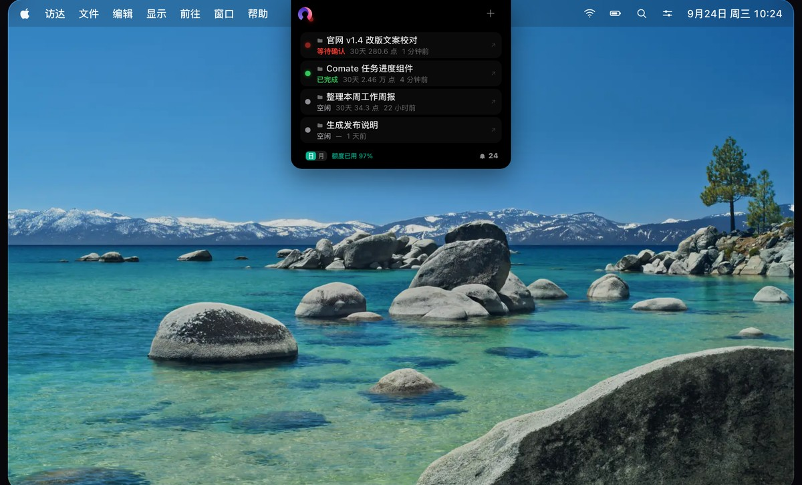

# Comate HUD

macOS AI 任务状态灯 — 为 [WPS Comate](https://comate.wps.cn) 而生。




## 功能

- 🟢 **实时状态灯** — 三色状态灯常驻刘海区（绿=空闲 / 黄=工作中 / 等待确认）
- 📋 **任务面板** — 悬停展开，查看最近会话和执行进度
- 🔔 **消息中心** — 铃铛角标动态显示未读消息数
- ⚡ **一键直达** — 点击任务直接打开对应 Comate 会话
- 📊 **额度用量** — 实时显示 AI 用量消耗，支持日/月切换

## 安装

1. 从 [Releases](../../releases/latest) 下载最新 DMG（也可以打开[产品介绍页](https://comate.wpsgo.com/s/HyDSehobOTHX/)，页面上同样能下载 —— 该页为 WPS 内网可见）
2. 打开 DMG，把 `ComateHUD.app` 拖进「应用程序」文件夹
3. 首次启动需放行一次，见下

### 首次打开被 macOS 拦截怎么办

本应用未使用 Apple 付费开发者证书签名，双击后 macOS 会拦截首次启动（提示「未打开“ComateHUD”」，Apple 无法验证其安全性）。任选一种方式放行：

- **方式一（图形界面）**：打开「系统设置」→「隐私与安全性」，下滑到「安全性」区域，点「已阻止“ComateHUD”以保护 Mac」旁的**仍要打开**，在二次弹窗「打开“ComateHUD”？」中再点**仍要打开**，输入系统密码。
- **方式二（终端）**：

  ```bash
  xattr -dr com.apple.quarantine /Applications/ComateHUD.app
  ```

  然后双击启动。

放行后按提示允许**辅助功能**权限（用于窗口定位与读取刘海区域）。DMG 内附同一份 `安装说明.txt`。

## 构建

```bash
# 需要 macOS 12.0+ 和 Xcode
cd ComateNotch
./build.sh
```

构建产物：`build/ComateHUD.app`（Universal Binary: arm64 + x86_64）

## 一键发布

```bash
cd ComateNotch
./release.sh <version> <build>
# 示例: ./release.sh 1.4.4 13
```

自动完成：构建 DMG → 更新版本清单 → 部署产品介绍页

## 项目结构

```
ComateHUD/              # 产品介绍页（通过 Comate 部署）
├── index.html          # 产品页（动态加载版本信息）
├── versions.json       # 版本清单（版本号 + 下载链接 + 更新日志）
└── icon.png            # 应用图标

ComateNotch/            # macOS 原生应用
├── Sources/
│   ├── ComateHUDApp.swift    # 应用入口
│   ├── ComateStore.swift     # 数据层（SQLite + 云端 API）
│   ├── NotchPanel.swift      # NSPanel 窗口管理
│   ├── NotchRootView.swift   # SwiftUI UI 层
│   ├── SessionJournal.swift  # Comate 日志解析
│   ├── UsageAPI.swift        # 用量 API
│   └── AppDelegate.swift     # App Delegate
├── Resources/          # 图标资源
├── Info.plist          # 应用配置
└── build.sh            # 构建脚本
```

## 技术栈

| 组件 | 技术 |
|------|------|
| 语言 | Swift 5.9+ |
| UI | SwiftUI |
| 窗口 | NSPanel |
| 数据 | SQLite (本地读取 Comate 聊天记录) |
| 网络 | URLSession (云端消息中心 + 用量 API) |
| 集成 | Deeplink (`wpscomate://` 协议) |
| 构建 | Universal Binary (arm64 + x86_64) |

## 兼容性

- macOS 12.0 (Monterey) 或更高版本
- Apple Silicon (M1/M2/M3/M4) & Intel x86_64
- 需安装 WPS Comate 桌面版

## 隐私

应用**不上传**你的任务内容、对话记录、文件路径或额度数据 —— 这些全部在本地读取与展示。唯一上报的是**匿名活跃统计**，用于了解有多少人在用、都在什么版本上：

| 字段 | 说明 |
| --- | --- |
| `uid` / `user_name` | 能读到 WPS 登录身份时为 WPS 账号 id 与昵称；读不到时退化为 `anon-<设备标识前 20 位>`（昵称留空） |
| `device_id` | 本机随机生成的标识，用于区分设备（不含硬件序列号） |
| `version` / `os_version` | 应用版本号与系统版本 |
| `active_day` / `launch_count` / `hover_count` / `click_count` | 当日日期与启动 / 悬停 / 点击次数 |

数据仅用于产品运营统计，不用于其他用途，也不对第三方共享。当前版本没有提供关闭开关；如果你不希望上报，欢迎提 issue。

## License

MIT
